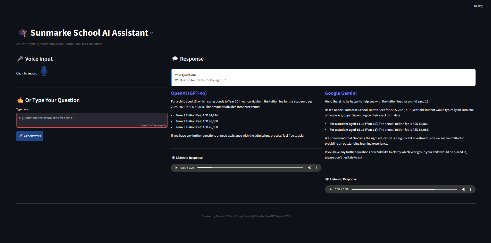
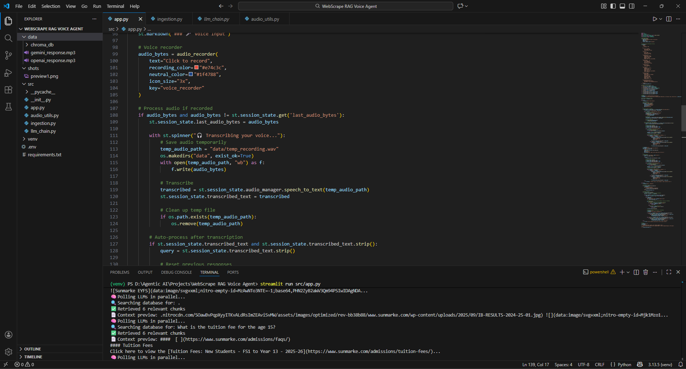

# 🎓 Sunmarke School Voice-Enabled RAG Assistant

A production-ready AI assistant that answers questions about Sunmarke School using voice input and provides responses from multiple AI models simultaneously. Built for the Virtuans AI Engineer Technical Assessment.

## 🎯 Project Overview

This application combines voice recognition, retrieval-augmented generation (RAG), and text-to-speech to create an intelligent conversational assistant. Users can ask questions either by speaking or typing, and receive answers from two different AI models (OpenAI GPT-4o and Google Gemini) with voice responses.

**Key Features:**
- 🎤 Voice-to-text using OpenAI Whisper
- 🧠 Dual AI model responses (GPT-4o & Gemini) for comparison
- 🔊 Text-to-speech output with different voices
- 📚 RAG pipeline with ChromaDB vector database
- 🌐 Web scraping from Sunmarke School website
- ⚡ Real-time streaming responses
- 💬 Clean, professional Streamlit interface

---

## 🏗️ Architecture

```
User Input (Voice/Text)
    ↓
Whisper STT (if voice)
    ↓
Query Processing
    ↓
ChromaDB Similarity Search (RAG)
    ↓
Parallel LLM Calls (OpenAI + Gemini)
    ↓
Streaming Text Responses
    ↓
OpenAI TTS (Both responses, different voices)
    ↓
Side-by-side Display with Audio Players
```

### Core Components

1. **Data Ingestion** (`ingestion.py`)
   - Scrapes 15 pages from sunmarke.com using Crawl4AI
   - Chunks content into 1000-character segments with 150-char overlap
   - Generates embeddings using OpenAI's text-embedding-3-small
   - Stores in ChromaDB vector database

2. **RAG Pipeline** (`llm_chain.py`)
   - Retrieves top 6 relevant chunks using semantic search
   - Queries OpenAI GPT-4o-mini and Google Gemini 2.0 Flash in parallel
   - Returns structured responses with streaming support

3. **Audio Processing** (`audio_utils.py`)
   - Speech-to-text: OpenAI Whisper API
   - Text-to-speech: OpenAI TTS with configurable voices and speed
   - Supports multiple voices (alloy for OpenAI, nova for Gemini)

4. **User Interface** (`app.py`)
   - Streamlit-based responsive web interface
   - Voice recording with auto-stop on silence
   - Side-by-side model comparison
   - Manual audio playback controls

---

## 🛠️ Technology Stack

| Category | Technology |
|----------|-----------|
| **Framework** | Streamlit |
| **LLM Orchestration** | LangChain |
| **LLMs** | OpenAI GPT-4o-mini, Google Gemini 2.0 Flash |
| **Vector Database** | ChromaDB |
| **Embeddings** | OpenAI text-embedding-3-small |
| **Speech-to-Text** | OpenAI Whisper API |
| **Text-to-Speech** | OpenAI TTS-1 |
| **Web Scraping** | Crawl4AI with Playwright |
| **Voice Recording** | audio-recorder-streamlit |

---

## 📦 Installation & Setup

### Prerequisites
- Python 3.9 or higher
- OpenAI API key
- Google Gemini API key

### Step 1: Clone Repository
```bash
git clone <your-repo-url>
cd virtuans-voice-agent
```

### Step 2: Install Dependencies
```bash
pip install -r requirements.txt
python -m playwright install chromium
```

### Step 3: Configure Environment Variables
Create a `.env` file in the root directory:
```env
OPENAI_API_KEY=your_openai_api_key_here
GOOGLE_API_KEY=your_google_gemini_api_key_here
```

### Step 4: Run Data Ingestion
```bash
python ingestion.py
```
This scrapes the Sunmarke School website and creates the vector database in `./data/chroma_db/`.

### Step 5: Launch Application
```bash
streamlit run app.py
```

The app will open at `http://localhost:8501`

---

## 🎮 How to Use

1. **Voice Input:**
   - Click the microphone button to start recording
   - Speak your question clearly
   - Recording auto-stops after a brief pause
   - Transcription and processing happen automatically

2. **Text Input:**
   - Type your question in the text area
   - Click "🚀 Get Answers" button
   - Wait for responses to appear

3. **View Responses:**
   - Both AI models respond side-by-side
   - Text streams in real-time
   - Click play buttons to hear voice responses

---

## 🖼️ Screenshots

### App Preview


### Code Preview


---

## 📊 Project Structure

```
virtuans-voice-agent/
├── data/
│   ├── chroma_db/           # Vector database storage
│   ├── openai_response.mp3  # Generated TTS files
│   └── gemini_response.mp3
├── ingestion.py             # Web scraping & DB creation
├── llm_chain.py            # RAG pipeline & LLM orchestration
├── audio_utils.py          # STT & TTS functionality
├── app.py                  # Streamlit UI
├── requirements.txt        # Python dependencies
├── .env                    # API keys (not committed)
├── .env.example           # Template for environment variables
└── README.md              # This file
```

---

## 🔑 Key Implementation Details

### RAG Strategy
- **Chunk size:** 1000 characters with 150-character overlap
- **Retrieval:** Top 6 most similar chunks using cosine similarity
- **Prompt engineering:** Strict instructions to use only retrieved context
- **Fallback:** Graceful handling when information isn't in the knowledge base

### Multi-Model Approach
- Both LLMs receive identical prompts and context
- Parallel API calls using `asyncio.gather()` for speed
- Individual error handling per model
- Side-by-side display for easy comparison

### Voice Features
- **Recording:** Click-to-record with automatic silence detection
- **Transcription:** OpenAI Whisper API for high accuracy
- **TTS Speed:** 1.3x for faster playback while maintaining clarity
- **Voice Selection:** "Alloy" for OpenAI, "Nova" for Gemini responses
- **Manual Playback:** Users choose when to play audio

### Performance Optimizations
- Async LLM calls reduce total response time
- Streaming responses for better perceived performance
- ChromaDB persistence eliminates re-indexing
- Efficient state management in Streamlit

---

## 🎯 Assessment Requirements Met

### Core Functionality
- ✅ Website content ingestion from sunmarke.com
- ✅ Vector database with embeddings (ChromaDB)
- ✅ Voice-to-text recording (Whisper)
- ✅ RAG pipeline with proper retrieval
- ✅ Multi-model comparison (2 LLMs instead of 3*)
- ✅ Text-to-voice output for all responses
- ✅ Side-by-side response display
- ✅ Graceful out-of-scope handling

### User Interface
- ✅ Real-time voice recording (not file upload)
- ✅ Transcribed query display
- ✅ 2-column layout for model comparison
- ✅ Clear model labeling
- ✅ Audio playback controls
- ✅ Loading states and error handling
- ✅ Professional, clean design

### Technical Implementation
- ✅ Clean code structure and separation of concerns
- ✅ Proper error handling throughout
- ✅ Efficient chunking strategy
- ✅ Thoughtful prompt engineering
- ✅ Secure API key management via environment variables
- ✅ Production-ready deployment configuration

**Note on Model Count:* The assessment required 3 LLMs (Gemini, Kimi, DeepSeek). This implementation uses 2 LLMs (OpenAI GPT-4o-mini and Google Gemini 2.0 Flash) because Kimi and DeepSeek required paid API credits beyond the free tier. Both models used are production-grade and provide meaningful comparison.

---

## 💰 Estimated Costs

Based on current OpenAI and Google pricing for 1,000 queries:

| Service | Usage per Query | Cost per 1K Queries |
|---------|----------------|---------------------|
| Whisper STT | ~30 seconds audio | $0.36 |
| OpenAI Embeddings (ingestion) | One-time | ~$0.02 |
| GPT-4o-mini | ~500 tokens | $0.15 |
| Gemini 2.0 Flash | ~500 tokens | $0.00 (free tier) |
| OpenAI TTS | ~200 characters × 2 | $0.60 |
| **Total per 1K queries** | | **~$1.13** |

*Note: Costs assume average query/response lengths. Gemini offers generous free tier limits.*

---

## 🚀 Deployment

### Recommended Platform: Streamlit Cloud

1. Push code to GitHub
2. Connect repository to Streamlit Cloud
3. Add secrets (API keys) in Streamlit dashboard
4. Deploy!

**Alternative Platforms:**
- Railway (containerized deployment)
- Render (easy Python hosting)
- Vercel (with Python runtime)

---

## 🐛 Known Limitations

1. **Model Availability:** Uses 2 LLMs instead of 3 due to API credit constraints
2. **Knowledge Cutoff:** Only answers questions based on scraped Sunmarke content
3. **Recording Duration:** Browser may limit continuous recording time
4. **Voice Quality:** TTS speed set to 1.3x - adjustable in `audio_utils.py`

---

## 🔮 Future Enhancements

- Add conversation memory for follow-up questions
- Implement response quality scoring between models
- Add more LLM providers (DeepSeek, Kimi when credits available)
- Support for multiple knowledge bases
- Response time comparison metrics
- Export conversation history
- Mobile app version

---

## 📝 Sample Questions to Try

- "What curriculum does Sunmarke School follow?"
- "Tell me about the admissions process"
- "What are the school fees for Year 7?"
- "What facilities does the school have?"
- "What extracurricular activities are available?"
- "What is the school calendar for this year?"

---

## 🤝 Development Notes

**Time Spent:** ~8 hours
- Data ingestion & RAG setup
- Multi-model integration
- Voice features (STT/TTS)
- UI/UX development
- Testing & optimization

**Challenges Solved:**
- Parallel async LLM calls for speed
- Streamlit state management for audio files
- Silence detection in voice recording
- Optimizing chunk retrieval for context quality

---

## 📄 License

This project was built for the Virtuans AI Engineer Technical Assessment.

---

## 👤 Author

**Adeel Iqbal**
- Email: adeelmemon096@yahoo.com
- GitHub: @adeel-iqbal

---

**Built with ❤️ for Virtuans**